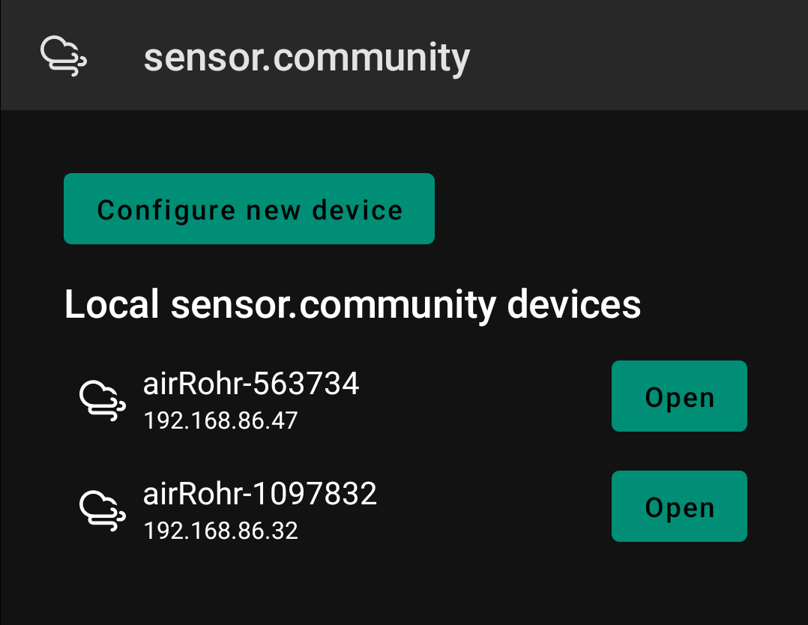

# Sensor.community local device manager

[Sensor.community](https://sensor.community/) is a contributors driven global sensor network that
creates Open Environmental Data. This project is an Android application that allows you to configure
new devices, as well as view existing sensors on the network, making it easy to check on their
local state.

This application is compatible with devices running Android API 29 and newer.

